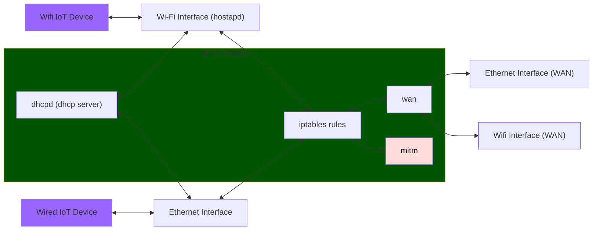

# mitmrouter

Bash script to automate setup of Linux router - useful for IoT device traffic analysis

This is based on [mitmrouter](https://github.com/nmatt0/mitmrouter) from Matt Brown (https://github.com/nmatt0)



## Dependencies
<b>This was built on Debian 12. Some config locations may differ for other linux based OS's</b>

- hostapd
> for creating the Wireless Access Point
- isc-dhcp-server (dhcpd)
> for providing DHCP to the clients
- iptables
> setting up routing rules


## Usage

You may want to disable NetworkManager as it may fight for control of one or more of the network interfaces.

Before running, take a look at the `# Network Information` section at the top of the script. Here, you can modify:
- Access Point SSID
- Access Point Password
- Network to give to clients
- DNS Servers

### Wireless Mode:

```
sudo ./mitmrouter.sh ap <wireless_interface> <wan_interface>
```
> wireless_interface: wireless interface used to create the AP<br>
> wan_interface: interface that's connected to the internet<br>

### Wired Mode:
```
sudo ./mitmrouter.sh wired <wired_interface> <wan_interface>
```
> wired_interface: wired interface that your clients are connected to<br>
> wan_interface: interface that's connected to the internet<br>

To exit, simply send a SIGINT (Ctrl-C). The script will clean up the IP assignments, and configurations applied to
services.